# EarLab — Screen Inventory & Detailed Site Map

This document provides a comprehensive inventory of all screens, views, modals, visual components, state transitions, and an architectural site map for the **EarLab** application.

---

## 1. System Overview & Architecture

EarLab is designed as a responsive, zero-latency desktop and mobile web workstation for ear training and tonal audiation. The frontend architecture consists of:
- **Application Shell** (`src/app/page.tsx`): Manages top-level routing, persistent audio context, active sessions, and modal overlays.
- **Desktop Sidebar** (`src/components/Sidebar.tsx`): Persistent left-hand rack with branding, primary tab navigation, real-time reference key/scale status, quick drone controls, and session counter.
- **Mobile Bottom Navigation** (`src/components/Navigation.tsx`): Touch-friendly tab bar for small screens.
- **Studio Header** (`src/components/Header.tsx`): Top bar displaying tonal context, session count, and quick settings access.
- **5 Core Views**: Home/Practice, Curriculum Matrix, Tonal Feeling Lab, Analytics & Retention, and Interactive Exercise Console.
- **2 System Overlays**: Studio Preferences Modal and Adaptive Placement Diagnostic Modal.

---

## 2. Screen Inventory & Associated Functionality

```
┌─────────────────────────────────────────────────────────────────────────────┐
│                             EarLab Studio Shell                             │
├───────────────┬─────────────────────────────────────────────────────────────┤
│ 1. Home /     │ • Next Due Practice Hero        • Daily Practice Sequencer  │
│    Dashboard  │ • Cognitive Telemetry Bar       • 4 Core Tracks Quick Rack  │
├───────────────┼─────────────────────────────────────────────────────────────┤
│ 2. Curriculum │ • 4-Track Matrix (A, B, C, D)   • Level Detail Breakdown    │
│    Matrix     │ • Cognitive Axis Flow Glyphs    • 40 Levels (Locked/Focus)  │
├───────────────┼─────────────────────────────────────────────────────────────┤
│ 3. Exercise   │ • Adaptive Melody Engine        • Tactile Keypad (1–7)      │
│    Console    │ • Live Vocal Pitch Meter (Mic)  • Retrieval Error Protocol  │
│               │ • Drone / Cadence Reference     • Session Outcome Modal     │
├───────────────┼─────────────────────────────────────────────────────────────┤
│ 4. Tonal      │ • Gravitational Vector Compass  • Tonic Drone Sounding Bed  │
│    Feeling Lab│ • 7 Diatonic Degree Audition    • Psychological Tendencies  │
├───────────────┼─────────────────────────────────────────────────────────────┤
│ 5. Analytics  │ • Diatonic Mastery Matrix (7)   • Perceptual Confusion Map  │
│    & Progress │ • Session Telemetry History     • JSON / CSV Data Export    │
├───────────────┼─────────────────────────────────────────────────────────────┤
│ Overlays &    │ • Studio Preferences & Audio    • Baseline Diagnostic Check │
│ Modals        │ • PWA Offline Installation      • Continuous Tonic Drone    │
└───────────────┴─────────────────────────────────────────────────────────────┘
```

---

### Screen 1: Practice & Today (Home Dashboard)
- **Primary Source File**: `src/components/views/HomeView.tsx`
- **Route / Trigger**: Default active tab (`activeTab === 'home'`)
- **Associated Subcomponents**:
  - `DailySequencer.tsx`
  - `FlowGlyph.tsx`
  - `TonalConstellation.tsx`
- **Pedagogical Purpose**: Acts as the daily launchpad for the musician, highlighting immediate priorities and tracking daily engagement.
- **Core Functionality**:
  1. **Next Due Practice Hero**:
     - Dynamically runs `getRecommendedTrack()` to evaluate whether the student should prioritize vocal internal hearing (Track A) or perceptual decoding (Track B).
     - Renders track and level badges (e.g., `A1 · Anchors`), phrase length, allowed degrees, and the cognitive axis flow glyph.
     - Direct CTA button: "Start Session · 10 min".
     - Secondary CTA button: "Placement Check" (triggers the diagnostic modal).
  2. **Daily Practice Sequencer**:
     - Breaks the recommended 40-minute daily routine into 4 modular 10-minute blocks:
       - **Block 1**: *Degree Singing* (Active vocal retrieval)
       - **Block 2**: *Degree Recognition* (Perceptual decoding)
       - **Block 3**: *Melody Singing* (Melodic contour audiation)
       - **Block 4**: *Melody Transcription* (Melodic dictation)
     - Allows instant launch of any block in the sequence.
  3. **Cognitive Telemetry Ribbon**:
     - **1st Attempt Accuracy (%)**: Clean first-time retrieval rate.
     - **Reveal Rate (%)**: Proportion of challenges requiring an answer reveal.
     - **Tonal Retention (%)**: Aggregated 7-degree Bayesian mastery.
     - **Today’s Time (min)**: Daily active training minutes logged.
  4. **Four Core Independent Tracks Quick Rack**:
     - Side-by-side status cards for Tracks A, B, C, and D.
     - Displays current level, descriptive title, and qualification bar (`X / 3` qualifying sessions with $\ge 80\%$ accuracy).
     - Direct action button to jump into that track's active level.

---

### Screen 2: Curriculum Architecture (4-Track Progression Matrix)
- **Primary Source File**: `src/components/views/CurriculumView.tsx`
- **Route / Trigger**: Navigation Tab (`activeTab === 'curriculum'`)
- **Associated Subcomponents**:
  - `FlowGlyph.tsx`
  - `TonalConstellation.tsx`
- **Pedagogical Purpose**: Complete syllabus transparency across all 40 progression levels (10 levels per track).
- **Core Functionality**:
  1. **Track Navigation Selector (A, B, C, D)**:
     - Toggle between **Track A (Singing)**, **Track B (Recognition)**, **Track C (Melody Singing)**, and **Track D (Transcription)**.
     - Displays total mastered levels across the curriculum.
  2. **Cognitive Axis Overview**:
     - Visual flow diagram outlining the auditory-cognitive mechanics for the selected track.
  3. **10-Level Linear Progression Matrix**:
     - Categorizes levels into:
       - **Mastered** (Checkmark icon, green accent): Available for revision.
       - **Active Focus** (Current rank, highlighted pill): Target for practice.
       - **Locked** (Padlock icon, dimmed): Unlocks upon qualifying the previous level.
     - Detailed parameter badges:
       - Phrase Length (e.g., `1 NOTE PROBE`, `3-NOTE PHRASE`).
       - Melodic Bounds (`STEPWISE`, `THIRDS`, `SKIPS`).
       - Harmonic Bed (`DRONE`, `CADENCE`, `A CAPPELLA`).
       - Target Challenge Count (e.g., `18 ITEMS`, `24 ITEMS`).
     - Visual pitch constellation ribbon displaying permitted scale degrees.

---

### Screen 3: Interactive Exercise Console (Session Workspace)
- **Primary Source File**: `src/components/views/ExerciseView.tsx`
- **Route / Trigger**: Launching any practice session (`activeSession !== null`)
- **Associated Subcomponents**:
  - `PitchDetector.ts` (Real-time autocorrelation pitch estimation)
  - `FlowGlyph.tsx`
  - `TonalConstellation.tsx`
  - `canvas-confetti`
- **Pedagogical Purpose**: Distraction-free, focused training environment where exercises are generated, auditioned, and assessed.
- **Core Functionality**:
  1. **Dynamic Melody Generation**:
     - Uses `generateMelody()` to generate random phrases compliant with the level's pitch set, max interval, and length.
     - Injects adaptive weighting using `findWeakestDegree()` to prioritize the student's weakest degrees.
  2. **Dual Exercise Paradigms**:
     - **Recognition & Transcription (Tracks B & D)**:
       - Reference audio plays automatically or via "Play Pitch" / "¾× Slower".
       - User inputs note choices via on-screen buttons (1–7) or keyboard numbers (`1`–`7`, `Backspace`, `Enter`).
       - Real-time answer chips reflect multi-note phrase input.
     - **Vocal Audiation & Singing (Tracks A & C)**:
       - Scale degree prompts are presented visually.
       - User audiates internally, sings the pitch, then taps the card or "Hear Reference" to self-verify.
       - Self-rating controls: *Matched* (1.0), *Close / Unsure* (0.5), *Missed* (0.0).
  3. **Live Microphone Vocal Pitch Meter**:
     - Autocorrelation-based pitch detector calculates fundamental frequency ($F_0$), nearest note name, and deviation in **cents** ($\pm 50$ cents).
     - Provides instant visual feedback on vocal intonation accuracy.
  4. **Harmonic Context & Cadence Rack**:
     - "Hear Tonic": Sounds the full tonal I–IV–V–I cadence.
     - "Tonic Drone": Toggles continuous background drone on/off.
     - Transposition and timbre dropdowns (Warm EP, Soft Piano, Reference Pure).
  5. **Retrieval Error & Anti-Guessing Protocol**:
     - On first failure, the answer is *not* given away immediately.
     - User is prompted to re-audiate with options: *Retry Retrieval*, *Hear Again*, or *Reveal Answer*.
     - Revealing records the error into the persistent confusion matrix and renders a comparison comparison view.
  6. **Session Completion Outcome**:
     - Renders full telemetry summary: First Attempt Accuracy, Assisted Accuracy, Duration, and Promotion Status.
     - Confetti animation and level unlock on promotion.

---

### Screen 4: Tonal Feeling Lab
- **Primary Source File**: `src/components/views/FeelingLabView.tsx`
- **Route / Trigger**: Navigation Tab (`activeTab === 'feeling'`) or URL query `?view=feeling`
- **Associated Subcomponents**:
  - `TonalGravityCompass.tsx`
- **Pedagogical Purpose**: Dedicated laboratory for active listening, learning the functional "feelings" and gravitational pulls of each diatonic degree against the tonic.
- **Core Functionality**:
  1. **Tonal Gravity Vector Compass**:
     - Interactive polar vector diagram displaying gravitational tendencies:
       - **Degree 7 (Leading Tone)**: High tension pulling upward to 1.
       - **Degree 4 (Subdominant)**: Strong pull downward to 3.
       - **Degree 2 (Supertonic)**: Buoyant tension resolving to 1 or 3.
       - **Degree 6 (Submediant)**: Melancholic pull downward to 5.
       - **Degrees 1, 3, 5**: Stable tonal anchors.
  2. **Harmonic Drone Bed**:
     - Starts a continuous root drone, allowing users to audition any scale degree over sustained harmony.
  3. **7 Diatonic Degree Audition Strip**:
     - Triggers note playback rendered with primary labels and optional sub-labels according to user notation preferences.
  4. **Functional Definition Card**:
     - Displays acoustic quality (Anchor, Buoyant, Resolution, Tension) and musical resolution behavior.

---

### Screen 5: Cognitive Analytics & Mastery Profile
- **Primary Source File**: `src/components/views/ProgressView.tsx`
- **Route / Trigger**: Navigation Tab (`activeTab === 'progress'`)
- **Associated Subcomponents**:
  - `DiatonicMasteryMatrix.tsx`
  - `ConfusionCrossTalk.tsx`
- **Pedagogical Purpose**: Provides deep visibility into long-term learning curves, retention probabilities, and systematic error patterns.
- **Core Functionality**:
  1. **Overview Telemetry Metrics**:
     - Total Sessions Completed, Total Probes Tested, First-Attempt Accuracy, and Levels Mastered.
  2. **Diatonic Mastery Matrix**:
     - 7-pillar interactive visual display for degrees 1 through 7.
     - Driven by a **Bayesian beta-distribution model** ($\alpha / (\alpha + \beta)$).
     - Color-coded mastery indicators with direct audio audition buttons for each pillar.
  3. **Auditory Cross-Talk Map**:
     - Visualizes systematic confusion pairs (e.g., confusing degree 6 for 5, or 2 for 3) based on session error logs.
     - Displays frequency and automatically feeds into targeted adaptive exercise generation.
  4. **Session History Log**:
     - Chronological list of recent training sessions showing track, level, qualification status, accuracy percentage, and duration.
  5. **Data Ownership & Portability**:
     - **Export JSON**: Complete database backup.
     - **Export CSV**: Formatted spreadsheet of all session records.
     - **Import JSON**: Seamless backup restore.
     - **Reset Database**: Clears local data and restores initial state.

---

### System Overlays & Modals

#### 1. Studio Preferences & Audio Setup
- **Primary Source File**: `src/components/views/SettingsModal.tsx`
- **Trigger**: Settings button in Sidebar, Header, or Settings tab.
- **Core Functionality**:
  - **Notation System**: Switch between **Scale Degrees** (`1`–`7`), **Movable-Do Solfège** (`Do`–`Ti`), and **Pitch Names** (`C`–`B`).
  - **Key & Scale Calibration**: Set default root pitch (12 chromatic keys) and scale (Major / Natural Minor).
  - **Timbre Selection**: Electric Piano (FM), Grand Piano, or Calibrated Pure Tone.
  - **Microphone Assessment**: Toggle on-device microphone pitch detector for Track A.
  - **Auto-Advance**: Toggle automatic progression on correct first-attempt response.
  - **PWA Installation**: Install application to desktop/mobile for offline workstation mode.
  - **Trigger Placement Diagnostic**: Shortcut to open the diagnostic placement check.

#### 2. Adaptive Baseline Diagnostic Modal
- **Primary Source File**: `src/components/views/DiagnosticView.tsx`
- **Trigger**: "Placement Check" in Home Hero or Settings Modal.
- **Core Functionality**:
  - **Vocal Register Setup**: Allows user to select their comfortable vocal key and test with an audio cadence.
  - **12-Step Adaptive Stimulus Probes**: Fast 3-step probes across Tracks B, A, D, and C testing immediate recognition vs. hesitant audiation.
  - **Auto-Placement Engine**: Computes initial starting levels across Tracks A, B, C, and D, allowing experienced musicians to bypass introductory anchor stages.

---

## 3. Visual Components & Telemetry Instruments

| Component | File Path | Function & Role |
| :--- | :--- | :--- |
| **DiatonicMasteryMatrix** | `src/components/visuals/DiatonicMasteryMatrix.tsx` | 7 vertical meters displaying Bayesian retention for degrees 1–7 with interactive audio playback. |
| **TonalGravityCompass** | `src/components/visuals/TonalGravityCompass.tsx` | Polar vector compass displaying the gravitational pulls of unstable degrees toward stable anchors. |
| **ConfusionCrossTalk** | `src/components/visuals/ConfusionCrossTalk.tsx` | Network diagram identifying systematic auditory substitutions and pitch confusion pairs. |
| **DailySequencer** | `src/components/visuals/DailySequencer.tsx` | 4-block modular progress tracker guiding users through the daily 40-minute training cycle. |
| **FlowGlyph** | `src/components/visuals/FlowGlyph.tsx` | Dynamic SVG badge illustrating the cognitive neuro-pathway for each track. |
| **TonalConstellation** | `src/components/visuals/TonalConstellation.tsx` | Compact horizontal ribbon showing active scale degrees allowed in a level. |
| **PWAInstallButton** | `src/components/PWAInstallButton.tsx` | Handles `beforeinstallprompt` browser events for one-click desktop/mobile app installation. |

---

## 4. Comprehensive Site Map

```mermaid
flowchart TD
    classDef shell fill:#09090b,stroke:#09090b,stroke-width:2px,color:#ffffff;
    classDef screen fill:#f4f4f6,stroke:#27272a,stroke-width:1.5px,color:#09090b;
    classDef overlay fill:#ffffff,stroke:#09090b,stroke-width:2px,stroke-dasharray: 5 5,color:#09090b;
    classDef action fill:#e4e4e7,stroke:#71717a,stroke-width:1px,color:#18181b;

    Root["EarLab Web Workstation (/)"]:::shell

    %% Persistent Layout Shell
    Shell["Studio Shell (Sidebar / Navigation / Header)"]:::shell
    Root --> Shell

    %% Main Navigation Tabs
    Shell --> TabHome["Screen 1: Practice & Today (Home)"]:::screen
    Shell --> TabCurriculum["Screen 2: Curriculum (A–D Matrix)"]:::screen
    Shell --> TabFeeling["Screen 3: Tonal Feeling Lab"]:::screen
    Shell --> TabProgress["Screen 4: Mastery & Analytics"]:::screen
    Shell --> ModalSettings["Modal: Studio Preferences & Audio"]:::overlay
    Shell --> ModalDiagnostic["Modal: Baseline Placement Diagnostic"]:::overlay

    %% Home Actions & Features
    TabHome --> HomeHero["Next Due Practice Hero"]:::action
    HomeHero --> LaunchRecSession["Start Recommended Session (10 min)"]:::action
    HomeHero --> LaunchDiag["Open Placement Diagnostic"]:::action
    TabHome --> DailySeq["Daily Practice Sequencer (4 x 10 min)"]:::action
    DailySeq --> LaunchTrackA["Block 1: Degree Singing"]:::action
    DailySeq --> LaunchTrackB["Block 2: Degree Recognition"]:::action
    DailySeq --> LaunchTrackC["Block 3: Melody Singing"]:::action
    DailySeq --> LaunchTrackD["Block 4: Melody Transcription"]:::action
    TabHome --> QuickTracks["4 Core Independent Track Cards"]:::action
    QuickTracks --> LaunchSpecific["Practice Track at Active Level"]:::action

    %% Curriculum Actions & Features
    TabCurriculum --> CurricTabs["Select Track (A, B, C, or D)"]:::action
    CurricTabs --> CurricLevels["10-Level Linear Matrix"]:::action
    CurricLevels --> LaunchLevel["Practice Active Level or Review Mastered Level"]:::action

    %% Active Exercise Session
    LaunchRecSession --> ScreenExercise["Screen 5: Active Exercise Console"]:::shell
    LaunchTrackA --> ScreenExercise
    LaunchTrackB --> ScreenExercise
    LaunchTrackC --> ScreenExercise
    LaunchTrackD --> ScreenExercise
    LaunchSpecific --> ScreenExercise
    LaunchLevel --> ScreenExercise

    %% Exercise Console Internal Features
    ScreenExercise --> ExKeypad["Tactile Keypad (1–7) & Keyboard Input"]:::action
    ScreenExercise --> ExAudioBar["Cadence, Tonic, Play Stimulus, 3/4x Speed"]:::action
    ScreenExercise --> ExDrone["Continuous Tonic Drone Toggle"]:::action
    ScreenExercise --> ExMic["Live Vocal Pitch Meter (Autocorrelation)"]:::action
    ScreenExercise --> ExErrorProtocol["Retrieval Error Protocol & Answer Reveal"]:::action
    ScreenExercise --> ExOutcome["Session Complete & Promotion Modal"]:::overlay
    ExOutcome --> Shell

    %% Feeling Lab Features
    TabFeeling --> FeelVector["Tonal Gravity Vector Compass Visualizer"]:::action
    TabFeeling --> FeelDrone["Tonic Scaffold Drone Audio"]:::action
    TabFeeling --> FeelDegrees["7-Degree Audition & Qualia Explanations"]:::action

    %% Progress / Analytics Features
    TabProgress --> MatrixVisual["7-Pillar Bayesian Diatonic Mastery Matrix"]:::action
    TabProgress --> CrossTalkVisual["Auditory Cross-Talk & Confusion Network Map"]:::action
    TabProgress --> SessionHistory["Recent Session Logs & Qualifications"]:::action
    TabProgress --> DataActions["Export JSON / Export CSV / Import Backup"]:::action

    %% Diagnostic Check Flow
    LaunchDiag --> ModalDiagnostic
    ModalDiagnostic --> DiagRegister["1. Comfortable Vocal Register Setup"]:::action
    DiagRegister --> DiagProbes["2. 12 Adaptive Stimulus Probes (B, A, D, C)"]:::action
    DiagProbes --> DiagApply["3. Calculate & Apply Level Placements"]:::action
    DiagApply --> Shell

    %% Deep-link query parameters
    DeepLinks["URL Deep Links:
    • ?view=feeling -> Opens Tonal Feeling Lab
    • ?action=continue -> Immediately launches recommended practice"]:::overlay
    Root -.-> DeepLinks
```



---

## 5. Screen & State Transition Table

| Triggering Location | Action / Event | Target Screen / Modal State | Relevant Files |
| :--- | :--- | :--- | :--- |
| **Home (Dashboard)** | Click "Start Session · 10 min" | **Exercise Console** (Recommended Track & Level) | `HomeView.tsx` → `page.tsx` |
| **Home (Dashboard)** | Click block in Daily Sequencer | **Exercise Console** (Selected Track at current level) | `DailySequencer.tsx` → `page.tsx` |
| **Home (Dashboard)** | Click "Placement Check" | **Baseline Diagnostic Modal** | `HomeView.tsx` → `DiagnosticView.tsx` |
| **Curriculum Matrix** | Click "Practice" or "Review" | **Exercise Console** (Specified Track & Level) | `CurriculumView.tsx` → `page.tsx` |
| **Exercise Console** | Click "Exit Console" | Returns to previous tab (**Home** or **Curriculum**) | `ExerciseView.tsx` → `page.tsx` |
| **Exercise Console** | Complete target challenges | **Session Outcome Overlay** (Scores, Confetti, Promotion) | `ExerciseView.tsx` |
| **Sidebar / Header** | Click Settings icon | **Studio Preferences Modal** | `Sidebar.tsx` / `Header.tsx` → `SettingsModal.tsx` |
| **Sidebar** | Toggle Tonic Drone button | Audio engine starts/stops background drone layer | `Sidebar.tsx` → `audioEngine.ts` |
| **Analytics Screen** | Click "Export JSON" / "Export CSV" | Triggers file download from local storage | `ProgressView.tsx` → `store.ts` |
| **Analytics Screen** | Select JSON file in "Import JSON" | Parses, validates schema version, and updates app state | `ProgressView.tsx` → `store.ts` |
