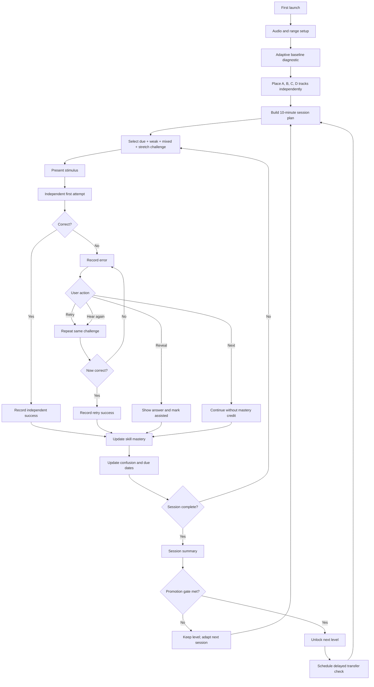
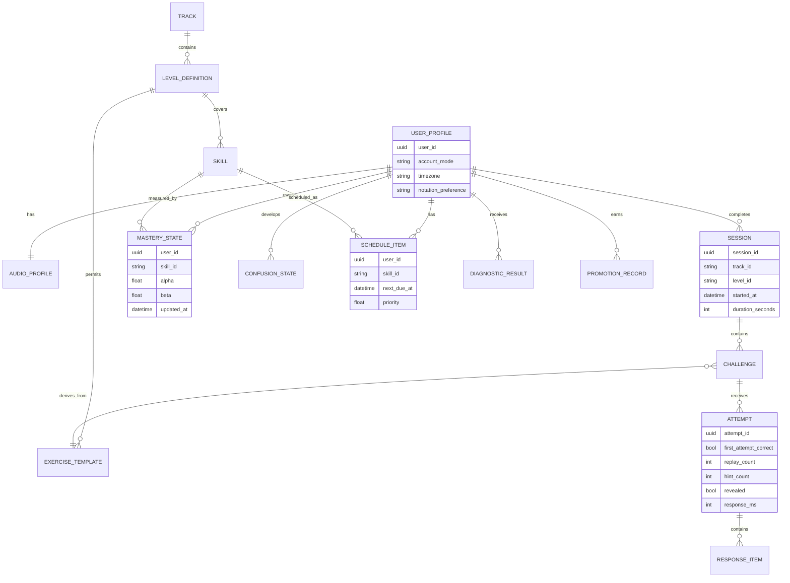

# Functional Ear Training Platform: Research-Backed Product Requirements Document

## Executive summary

The product should evolve from a random scale-degree exercise generator into a **progressive, adaptive functional-musicianship system** whose core learning loop is:

**establish tonal center → audiate → retrieve/perform → receive delayed corrective feedback → diagnose weakness → revisit at an appropriate interval → generalize to harder musical contexts.**

The strongest conclusion from the research is not that one particular ear-training “method” wins universally. Leading institutions use different labeling systems—Juilliard teaches fixed-do solfège in its ear-training curriculum, while Berklee explicitly uses movable-do—but they converge on the same deeper competencies: **active singing, melodic and rhythmic dictation, internal hearing, tonal orientation, recognition, notation/performance translation, and progressive complexity**. Berklee proceeds from major-key melodic/interval/rhythmic work into minor, modes, chromatic functions, more advanced rhythm, and multi-part dictation; Juilliard combines solfège, performance, and dictation; Eastman explicitly frames aural musicianship as immediate recognition, comprehension, and expressive performance of heard and seen material; the Royal College of Music Junior Department uses a staged foundation/fundamentals/Level 1/Level 2 progression tied to demonstrated aural ability; and Curtis publicly documents structured theory/solfège study and regular progress review for its young artists. citeturn17view3turn17view4turn18search0turn18search6turn17view5turn15view12turn15view13turn15view14turn17view6

The research also argues against turning the product into endless drills. Distributed practice has a robust general memory literature behind it, and a music-specific study found learning differences when practice sessions were separated by hours or a day rather than only minutes. Retrieval practice improves long-term retention in broader learning research. Interleaving can improve musical-interval learning, but Wong, Chen, and Lim found that its advantage depended on context; therefore the system should **teach new material in constrained blocks, then progressively interleave it** rather than randomizing everything from the outset. citeturn15view5turn19search3turn19search14turn19search5turn17view0

The singing/dictation evidence is especially useful for product design. Successful sight-singers in Killian and Henry's study more often established the tonic, sang during preparation, used physical beat strategies, and benefited from preparation time; however, the particular sight-singing system itself did not significantly differentiate performance. A recent pilot found that collective sight-singing before dictation improved dictation performance, while Buonviri found that **requiring** individual students to sing a melody before notating it actually reduced dictation accuracy. Therefore Degree Singing, Degree Recognition, Melody Singing, and Melody Transcription should remain distinct but interconnected tracks; singing should not be forcibly inserted into every transcription task. citeturn17view2turn17view1turn15view4

The recommended product is therefore built around these decisions:

| Decision | PRD requirement |
|---|---|
| Learning model | Four independently leveled tracks, not one global difficulty |
| Core notation | Scale degrees `1–7`; optional movable-do labels; note names hidden by default |
| Session design | Approximately 10-minute micro-sessions, with time-budgeted challenge counts |
| Progress | Demonstrated first-attempt mastery across multiple spaced sessions, not XP/completion |
| Adaptivity | Weakness-driven but coverage-constrained; never endlessly drill one weak item |
| Feedback | Retrieval first; correction second. Wrong answers trigger Retry / Hear Again / Reveal / Next |
| Melodies | Curated + constrained generative motifs, never uniform random scale-degree strings |
| Tonal reference | Tonic/drone used as temporary scaffolding and progressively withdrawn |
| Audio | High-quality sampled musical instrument plus neutral reference synth and clean drone |
| Singing scoring | Self-verification in initial release; optional on-device microphone scoring later |
| Storage | Local-first/offline-first, optional cloud synchronization |
| Dashboard | Learning metrics over engagement vanity metrics |
| Advanced curriculum | Major → minor → modes → chromatic function → rhythm+pitch → broader timbre transfer |

**The four tracks should have separate levels.** A learner might legitimately be A7 in Degree Singing, B6 in Degree Recognition, C4 in Melody Singing, and D3 in Melody Transcription. The platform should preserve those differences rather than averaging them into a misleading “Level 5.”

**The proposed 85–90% promotion thresholds, challenge counts, adaptive weighting formulas, and precise review intervals below are product specifications—not quantities established by the cited research as universally optimal.** They are deliberately conservative starting hypotheses that should be validated with real learner telemetry and delayed-transfer testing.

## Evidence base and pedagogy synthesis

The curricula surveyed strongly support a **spiral curriculum**: basic tonal/rhythmic vocabulary is learned first, then revisited under increasingly difficult conditions—new keys, minor/modal contexts, chromaticism, longer memory spans, more complex rhythms, and polyphony.

Berklee gives the clearest publicly accessible example. Its Fundamentals course explicitly targets musical memory, inner hearing, melodic/rhythmic sight-reading and basic dictation while translating sound to notation and notation to sound; its sequence then moves through major, minor, modes, harmonic/melodic minor, interval work, increasingly advanced rhythm, modal singing/dictation, multi-part dictation, and eventually chromatic functions and modulation. Berklee also uses placement scores to accelerate sufficiently prepared students rather than making everyone begin at the same level. citeturn17view3turn17view4

Juilliard provides an important counterexample to any claim that movable-do alone is “the proven system”: its Ear Training I descriptions use **fixed-do**, clef reading, rhythm performance/dictation and one-part melodic dictation, while another current course description emphasizes repeated dictations and performance-based recitations. This supports using scale-degree numbers as the platform's stable functional representation while allowing optional solfège terminology instead of making one naming convention pedagogically mandatory. citeturn18search0turn18search3turn18search6

Eastman's stated curriculum philosophy is unusually aligned with the product vision: its undergraduate aural-musicianship curriculum emphasizes “immediate recognition, comprehension, and expressive performance” of musical material as heard and seen, and connects aural work closely to written theory rather than treating ear training as disconnected interval trivia. citeturn17view5

The Royal College of Music's current 2026–27 Junior Department documentation similarly describes a progression from Foundation Aural and Musicianship through Fundamentals and Levels 1 and 2, with progression dependent on demonstrated aural perception and prior skills. Its foundation work also incorporates active listening, meter, tempo, phrase, form, rhythmic pattern, movement, and repertoire; later work integrates higher-level harmony and analysis. citeturn15view12turn15view13turn15view14

Curtis publishes less granular current aural-skills detail publicly than Berklee or RCM, so the product should not imply that a specific Curtis syllabus was reproduced. Its official materials do, however, document structured theory and solfège instruction and regular review of student progress. citeturn17view6

| Evidence area | What the evidence supports | Product implication |
|---|---|---|
| Conservatory curricula | Singing, recognition, dictation, rhythm and progressive tonal complexity recur across programs. citeturn17view3turn17view4turn18search0turn17view5 | Build integrated but independently leveled skills rather than an interval-identification-only app. |
| Solfège systems | Strong programs use different systems; one sight-singing study found no significant performance difference attributable to the system used. citeturn17view2turn18search0turn17view4 | Make numbers primary, movable-do optional, note names optional. |
| Tonicization | More successful sight-singers more often established the tonal center before performing. citeturn17view2 | “Hear tonic” and tonic-establishment routines are first-class features. |
| Retrieval | Testing/retrieving learned information can strengthen later retention relative to additional restudy. citeturn19search3turn19search14 | Require an answer before displaying the target whenever pedagogically possible. |
| Spacing | Distributed practice is robust across learning research; optimal lag varies with desired retention interval rather than having one magic schedule. citeturn15view5 | Support several short sessions and a due-review queue; do not claim 4×10 is uniquely optimal. |
| Music-specific spacing | A musicians' skill-learning experiment found practice-session interval affected consolidation/performance. citeturn19search5 | Avoid placing all repetitions of a mastered skill into the same block. |
| Interleaving | In melodic interval learning, interleaving outperformed blocking under one experimental condition but not another. citeturn17view0 | Introduce a skill with low-entropy blocked practice, then mix it with previously learned skills. |
| Singing before dictation | Evidence is mixed: one collective pre-dictation sight-singing pilot showed benefit, while forced individual singing before notation reduced scores in another study. citeturn17view1turn15view4 | Do not require overt singing during every Melody Transcription challenge. |
| Drones | Drone accompaniment remains a significant research theme in intonation education, but the literature does not justify treating continuous drone use as universally superior. citeturn16view6 | Drone is an optional scaffold that fades with mastery, not a permanent dependency. |
| Timbre | Experimental work shows that timbre manipulations can affect pitch-interval discrimination. citeturn20search1turn20search16 | Keep timbre stable early; deliberately introduce timbre variation later as transfer training. |
| Rhythm + pitch | Major conservatory curricula explicitly integrate increasingly complex rhythmic work with aural skills. citeturn17view3turn17view4turn15view12 | Add rhythmic complexity only after pitch-function competence is stable. |

A particularly important product inference is that **isolated interval naming should be subordinate to tonal function**, not deleted entirely. Berklee includes interval studies, and interval-learning research confirms they are trainable, but the platform's objective is functional hearing: recognizing what a pitch *is doing relative to tonic and within melody*. Interval distance is therefore best captured as a secondary skill dimension—“6→2 descending fourth,” for example—inside degree-based melodic training. citeturn17view4turn17view0

Likewise, drones should not become a crutch. The app should begin with abundant tonal support, then progressively test whether the learner can retain tonic internally after the reference disappears. That is consistent with the strong role tonicization played among successful sight-singers and with Eastman's emphasis on immediate internal comprehension rather than repeated external prompting. citeturn17view2turn17view5

## Product definition and prioritized requirements

**Product vision.** Build the most effective mobile-first environment for developing functional relative pitch: users should increasingly be able to hear a tonal center, understand scale-degree function, internally hear notation or numbers, sing accurately, recognize what they hear, reproduce connected melodies, and transcribe novel melodic material.

**Primary learning outcome.** After sustained use, performance should improve on **unseen transfer material**, not merely on repeated app items. A learner who achieves 90% because the app repeatedly serves familiar templates has not demonstrated genuine mastery.

**Core terminology.**

A **challenge** is one scored retrieval opportunity. An **attempt** is one response to a challenge; retries belong to the same challenge. A **session** is a roughly ten-minute practice block. A **skill** is an atomic dimension such as degree 6, transition 3→6, ascending fifth, eight-note phrase memory, or recognition after five challenges without tonic reinforcement. A **level** defines an allowed skill envelope. **Independent accuracy** counts the first response before hints, replay of individual answers, or reveal. **Assisted accuracy** records eventual success after help.

### Prioritized feature set

| Priority | Requirement | Why it exists | Effort |
|---|---|---|---|
| **P0** | Four separately leveled tracks | Prevents global difficulty from hiding skill asymmetry | High |
| **P0** | Scale degrees 1–7 with optional solfège labels | Functional representation; naming-system neutral | Low |
| **P0** | Baseline placement diagnostic | Avoids wasting experienced users' time; analogous to placement practice used at Berklee. citeturn17view3turn17view4 | Medium |
| **P0** | High-quality tonic, drone, per-note and melody playback | Audio is the instructional material, not decoration | High |
| **P0** | Tappable degree buttons | Essential for fast mobile transcription and verification | Low |
| **P0** | Hear tonic / Play / Slow / per-note verification | Supports tonal calibration and deliberate checking | Medium |
| **P0** | Retry / Hear Again / Reveal / Next error flow | Preserves retrieval opportunity before exposing answer | Medium |
| **P0** | First-attempt vs assisted scoring | Prevents hints from masquerading as mastery | Medium |
| **P0** | Local progress persistence and offline mode | Practice must work reliably anywhere | Medium |
| **P0** | Adaptive challenge selector | Converts statistics into targeted growth | High |
| **P0** | Curated/constrained melody engine | Prevents “random-number melody” problem | High |
| **P0** | Three-session promotion gate | Requires repeatable performance rather than one lucky session | Medium |
| **P0** | Learning dashboard | Makes growth and weak areas visible | Medium |
| **P1** | Full minor curriculum | Mirrors progression found in formal ear-training curricula. citeturn17view3turn17view4 | Medium |
| **P1** | Modes and common chromatic functions | Advanced functional transfer; Berklee explicitly advances into modes/chromatic functions. citeturn17view4 | High |
| **P1** | Rhythm+pitch integrated exercises | Makes the task increasingly music-like | High |
| **P1** | Optional account/cloud sync | Multi-device continuity | Medium |
| **P1** | JSON/CSV export and full backup/import | User ownership and portability | Medium |
| **P1** | Timbre-transfer mode | Generalizes hearing beyond a single instrument | Medium |
| **P1** | On-device single-note singing assessment | Makes Degree Singing scoring more objective | High |
| **P1** | Notification/due-review scheduler | Supports distributed practice without streak pressure | Medium |
| **P2** | Phrase-level vocal pitch segmentation | Automatically scores Melody Singing | High |
| **P2** | Teacher/coach dashboard | Enables guided curriculum assignments | High |
| **P2** | Two-part melodic/harmonic dictation | Follows advanced conservatory progression | High |
| **P2** | Licensed/public-domain repertoire exercises | Bridges synthetic exercises and real music | High |
| **P2** | Content-authoring system | Allows musicians/educators to create vetted exercise banks | High |
| **P2** | Experimental personalization models | Learner-specific forgetting/difficulty prediction | High |

Features that should **not** dominate the initial product are leaderboards, social comparison, coins, XP farming, streak punishment, large avatar systems, or unlimited AI-generated melodies. None directly solves the primary learning problem. Light motivation mechanics may eventually support adherence, but advancement must remain tied to demonstrated musicianship.

The primary interface representation should remain **scale-degree numbers** because that directly matches the product's functional-hearing objective. Users may enable `Do Re Mi…`, fixed note names, or both as overlays, but the answer representation should not require absolute note-name knowledge.

## Training architecture and level matrices

Each track advances independently. The first eight levels create a strong major-key functional foundation. The final levels deliberately introduce minor, modes, chromatic function, rhythmic complexity, and wider transfer, reflecting the broad progression visible in conservatory curricula. citeturn17view3turn17view4turn18search0

The exact challenge counts are **session design targets**. A session ends at approximately 9½ minutes if the target challenge count has not yet been reached, reserving the remainder for a concise review. Longer exercises naturally use fewer challenges.

**Degree Singing — Track A: number → audiation → voice → verification**

| Level | Material | Tonal support and difficulty | Target challenges / 10 min |
|---|---|---|---:|
| **A1 Anchors** | Single `1, 3, 5` | Tonic before every challenge; one target at a time | 18–24 |
| **A2 Pentachord** | Single `1–5` | Tonic every 1–2 challenges | 18–24 |
| **A3 Add Six** | Single `1–6` | More 2/4/6 tension tones; randomized order | 18–24 |
| **A4 Full Diatonic** | Single `1–7` | All major degrees; tonic every 2–3 challenges | 21 |
| **A5 Degree Pairs** | Two-note cells using `1–7` | Includes thirds/fourths; one tonic per pair | 14–18 |
| **A6 Melodic Cells** | 3–4-note cells | Motif-like shapes; mostly steps/thirds | 10–14 |
| **A7 Tonal Retention** | Singles and short cells | Tonic only every ~5 challenges | 12–16 |
| **A8 Key Transfer** | Full major system | New keys, larger leaps, tonic retained across a block | 10–14 |
| **A9 Minor Function** | Natural, harmonic and melodic minor functions | Stable distinction between altered scale functions | 10–14 |
| **A10 Functional Expansion** | Modal and common chromatic degrees | e.g. ♯4, ♭7 where contextually meaningful; mixed keys | 8–12 |

The essential A-track UX is **do not play the answer before the user has attempted to sing it**. The sequence is:

`Hear tonic → see 6 → internally hear 6 → sing → tap/verify 6 → self-rate or microphone-score`.

That design operationalizes retrieval/audiation rather than imitation.

**Degree Recognition — Track B: sound → functional label**

| Level | Material | Difficulty control | Target challenges / 10 min |
|---|---|---|---:|
| **B1 Poles** | `1` vs `5` | Tonic before every target | 24–30 |
| **B2 Triad Anchors** | `1, 3, 5` | Stable chord-tone categories | 24–30 |
| **B3 Add Neighbors** | `1, 2, 3, 5` | Introduces 2 without full seven-way choice | 22–28 |
| **B4 Pentachord** | `1–5` | Full lower pentachord | 22–28 |
| **B5 Add Six** | `1–6` | Greater functional ambiguity | 21–26 |
| **B6 Full Diatonic** | `1–7` | Seven-way first-attempt identification | 21–26 |
| **B7 Sparse Tonic** | `1–7` | Tonic only periodically | 18–24 |
| **B8 Transfer** | `1–7` | Random keys, octave placements and clean timbre variation | 18–24 |
| **B9 Minor Recognition** | Minor functions | Natural/harmonic/melodic contexts | 16–22 |
| **B10 Functional Expansion** | Major/minor/modal/chromatic | Mixed contexts and transfer timbres | 14–20 |

Speed should not be used as a major difficulty variable before accuracy stabilizes. Once B6 or later is mastered, the system may measure response time and gradually ask for fluent recognition, but **speed should never convert an incorrect response into a passing one**.

**Melody Singing — Track C: visible functional melody → audiation → sung phrase**

| Level | Phrase specification | Musical constraints | Target challenges / 10 min |
|---|---|---|---:|
| **C1 Anchor Cells** | 3 notes, `1/3/5` | Simple repeated/chord-tone patterns | 10–14 |
| **C2 Stepwise Pentachord** | 4 notes, `1–5` | Mostly adjacent movement | 10–12 |
| **C3 Steps + Thirds** | 4–5 notes, `1–5` | Small skips plus contour changes | 8–12 |
| **C4 Expanded Phrase** | 6 notes, `1–6` | Phrase-shaped cells and cadence tendencies | 8–10 |
| **C5 Full Major Phrase** | 6 notes, `1–7` | All diatonic degrees | 8–10 |
| **C6 Eight-Note Melody** | 8 notes | Motif/repetition/direction change | 6–8 |
| **C7 Leap Control** | 8 notes | 4ths/5ths, occasional wider leap, sparse tonic | 6–8 |
| **C8 Long-Form Major** | 12–16 notes | Two subphrases, stronger memory/audiation demand | 4–6 |
| **C9 Minor + Rhythm** | 8–12 notes | Minor functions plus simple unequal durations | 5–7 |
| **C10 Advanced Musical Phrase** | 12–16 notes | Modes/chromatic functions + richer rhythm/timbre transfer | 4–6 |

This is where the earlier 16-degree idea belongs: **not as beginner material, but as an advanced sustained-audiation task**. The same 16-note phrase can be difficult because of phrase length, interval complexity, tonal ambiguity, rhythm, or sparse tonic reinforcement; those dimensions should not all be raised simultaneously.

**Melody Transcription — Track D: heard melody → internal representation → scale-degree sequence**

| Level | Phrase specification | Input/response | Target challenges / 10 min |
|---|---|---|---:|
| **D1 Two-Note Anchors** | 2 notes, `1/3/5` | Hear then enter degrees | 14–18 |
| **D2 Three-Note Cells** | 3 notes, `1/3/5` | Chord-tone contour | 12–16 |
| **D3 Stepwise Four** | 4 notes, `1–5` | Mostly adjacent movement | 10–14 |
| **D4 Mixed Four/Five** | 4–5 notes | Steps + thirds | 10–12 |
| **D5 Six-Note Expanded** | 6 notes, `1–6` | Greater memory and function load | 8–10 |
| **D6 Full Diatonic Six** | 6 notes, `1–7` | All seven degrees | 8–10 |
| **D7 Eight-Note Melody** | 8 notes | Motif/contour/cadence | 6–8 |
| **D8 Advanced Major** | 8–12 notes | Larger leaps, sparse tonic, new keys | 5–7 |
| **D9 Minor + Rhythm** | 8–12 notes | Minor function plus rhythmic transcription | 5–7 |
| **D10 Advanced Transcription** | 12–16 notes | Modal/chromatic, richer rhythm, timbre transfer | 4–6 |

The D-track should explicitly avoid requiring singing before every response. Buonviri's experiment found poorer dictation performance when undergraduate music majors were required to sing before notating; another pilot found a benefit from a collective sight-singing preparation activity. The safest product interpretation is to offer **optional subvocalization/humming/solfège strategies while keeping transcription itself independent**. citeturn15view4turn17view1

Across all tracks, difficulty is represented on several orthogonal axes rather than a single “Easy / Medium / Hard” value:

| Difficulty dimension | Examples |
|---|---|
| Tonal vocabulary | `1/3/5` → `1–5` → `1–7` → minor → chromatic |
| Phrase length | 1 → 2 → 4 → 6 → 8 → 12 → 16 |
| Interval complexity | repeats/steps → thirds → fourths/fifths → sixths/sevenths |
| Tonic availability | every item → every few items → once per block |
| Key variation | one comfortable key → nearby keys → all practical keys |
| Register variation | fixed octave → controlled octave displacement |
| Rhythm | isochronous → simple durations → syncopated/mixed patterns |
| Timbre | fixed reference → fixed musical → controlled variation |
| Memory load | immediate response → longer phrase/retention |
| Response mode | recognition → free reconstruction |
| Harmonic context | major → minor → modes → chromatic function |

This separation is critical: a learner can train a six-note melody with all seven degrees while keeping intervals easy, or train difficult leaps in a four-note phrase without simultaneously imposing 16-note working-memory demands.

## Progression, diagnostics, adaptation, and scheduling

**Baseline diagnostic.** The first run should not assume Level A1/B1/C1/D1. Berklee's published courses use ear-training placement scores for entering students and offer accelerated pathways, which supports the general product principle of placement before instruction. citeturn17view3turn17view4

The diagnostic should take approximately **12–18 minutes**, after an audio setup and comfortable-register step.

| Diagnostic stage | Purpose |
|---|---|
| Audio setup | Confirm playback, volume and preferred musical timbre |
| Vocal range setup | Choose a comfortable tonic/register for singing |
| Degree Singing probe | Estimate single-degree and short-cell production ceiling |
| Degree Recognition probe | Estimate functional-label recognition ceiling |
| Melody Singing probe | Estimate phrase-length/interval ceiling |
| Melody Transcription probe | Estimate auditory decoding/memory ceiling |
| Calibration output | Recommend a starting level independently for A/B/C/D |

Placement should be adaptive. Begin near Level 4. A strong block—for example at least 3 of 4 independent items correct—moves the next probe upward; a clearly weak block moves downward. Once the approximate boundary is found, test adjacent levels. The user should start approximately **one step below an uncertain ceiling** rather than being placed exactly at the hardest item survived.

For singing tracks without microphone assessment, the user should sing first, hear the reference second, then report **Matched / Close or Unsure / Missed**. Because self-assessment is less reliable than recognition scoring, initial A/C placement should be marked “provisional” and recalibrated from the first three sessions. Optional microphone scoring can later improve confidence without making microphone access a prerequisite for using the platform.

**Promotion rules.** Level completion alone does not unlock the next level. Promotion is based on *independent first attempts*.

Recommended launch thresholds:

| Level band | Overall first-attempt threshold | Individual active-skill floor | Qualifying sessions |
|---|---:|---:|---:|
| Levels 1–3 | ≥85% | ≥75% | 3 |
| Levels 4–7 | ≥88% | ≥80% | 3 |
| Levels 8–10 | ≥90% | ≥85% | 3 |

Qualifying sessions must span at least **two calendar days**. A Reveal-assisted response never counts as independent success. A correct Retry is useful learning evidence but does not retroactively make the original attempt correct. Promotion also requires adequate coverage: every scale degree or required skill class must have enough independent observations to prevent a learner from passing because the generator happened to avoid their weakness.

These thresholds are intentionally product-defined rather than presented as a scientific law. The research supports retrieval and spacing generally, but it does not establish “88% over exactly three sessions” as an optimal universal mastery criterion. citeturn15view5turn19search3turn19search14

**Adaptive weakness model.** Each attempt should update more than “degree 6 accuracy.” Store performance across:

`target degree`  
`previous degree → target degree`  
`directed interval size`  
`contour`  
`key`  
`register`  
`tonic age`  
`phrase-length bucket`  
`rhythmic complexity`  
`timbre`  
`replay count`  
`hint/reveal state`  
`response latency`.

For each atomic skill, maintain a smoothed mastery estimate—for example a Beta-Bernoulli posterior:

```text
success evidence = independent first-attempt correctness
failure evidence = independent first-attempt error

Beta(alpha, beta)
alpha = 1 + weighted successes
beta  = 1 + weighted failures
mastery = alpha / (alpha + beta)
```

Assistance alters evidence:

```text
Independent correct       = 1.00 success
Correct after retry       = 0.50 success + original failure remains
Correct after hint        = 0.25 success
Answer revealed           = 0 success; schedule future retrieval
Skipped                   = unscored or low-confidence failure, depending context
```

The challenge-selection priority can begin with:

```text
priority(s) =
    0.40 × weakness(s)
  + 0.20 × uncertainty(s)
  + 0.20 × due(s)
  + 0.15 × confusion(s)
  + 0.05 × coverage_need(s)
```

where `weakness = 1 − mastery`, uncertainty rises when evidence is sparse, `due` rises as the skill becomes ready for spaced retrieval, confusion reflects systematic substitutions such as target 6→answer 4, and coverage prevents neglected skills from disappearing.

A ten-minute session should approximately comprise:

**60%** weak or due material  
**25%** mixed previously successful material  
**15%** controlled stretch material.

These proportions are starting product parameters, not research-derived constants. They prevent two common failure modes: random practice that ignores weaknesses and hyper-adaptive practice that drills one failure until the learner memorizes the item rather than improving the underlying skill.

A strong confusion model is particularly important for Recognition and Transcription. Instead of reporting merely “degree 6 = 68%,” the application should know:

`6 → answered 4: 11%`  
`6 → answered 2: 8%`  
`6 → answered 5: 5%`.

It can then generate controlled contrasts among 6, 4 and 2 within new keys and melodic contexts.

**Progressive interleaving.** New concepts should first appear within a constrained set and later be mixed. Wong and colleagues found that interleaving could outperform blocking for novel interval identification under one learning condition, while the benefit disappeared when reference-song/singing aids were used. That argues for **adaptive interleaving**, not the dogma that all practice must be random. citeturn17view0

A useful state machine is:

`Introduce → stabilize → interleave → transfer → retain`.

For example, degree 6 may initially occur in a small contrast set (`1,3,5,6`), then among all seven degrees, then in different keys, then after the tonic is withheld, then in melodies.

**Melody generation.** Pure randomness should be prohibited. The content system should use two sources:

1. **Curated motifs** composed/reviewed by musicians and tagged by difficulty.
2. **Constrained variants** generated from those motifs.

Each template should be tagged with scale degrees, intervals, contour, cadence, phrase length, rhythmic difficulty, tonal vocabulary, key suitability and required level. A generator may transpose, sequence, vary a repeated tone, alter one interior scale degree within allowed constraints, or transform rhythm while preserving pedagogical purpose.

For procedural phrases, use a musical grammar rather than independent random-number draws. Earlier levels heavily favor steps/repeats; later levels progressively permit thirds, fourths, fifths and wider leaps. Phrase contours should have direction, occasional repetition/motif, and plausible endings. Advanced melody pools should be manually reviewed before shipping.

**Distributed practice scheduling.** The user's preferred **4 × 10 minute** pattern is a sound product format, but the product must not claim that four ten-minute sessions at specific clock times are scientifically proven to be uniquely optimal. Spacing research shows that distributed episodes generally improve long-term retention and that ideal spacing depends on retention goals; music-specific work also suggests consolidation can depend on inter-session interval. citeturn15view5turn19search5

A recommended daily schedule is:

| Micro-session | Primary task | Internal structure |
|---|---|---|
| **Session A** | Degree Singing | brief tonal calibration → independent production → targeted weak degrees |
| **Session B** | Degree Recognition | due items → mixed recognition → short transfer block |
| **Session C** | Melody Singing | current-level phrases → one stretch phrase → targeted transition review |
| **Session D** | Melody Transcription | current-level dictation → errors from earlier sessions → delayed retrieval |

These can map naturally to morning/lunch/evening/bedtime, but the UI should call them simply **Session A–D** or recommend “Next practice” rather than imposing lifestyle terminology.

Review intervals should initially be simple and editable by the adaptive engine:

`error → retry after several other challenges + again next session`  
`first independent success → next day`  
`repeated success → ~3 days`  
`stable success → ~7 days`  
`highly stable → ~14–30 days`.

Again, those precise intervals are initial scheduling heuristics. The system should eventually estimate each learner's forgetting curve from actual delayed-retrieval performance.



The feedback flow requested in previous platform iterations should therefore remain exactly intentional: **correct → short confirmation → automatic next item; incorrect → do not immediately reveal → Retry / Hear Again / Reveal Answer / Next**.

## Audio and mobile engineering

Audio is pedagogical infrastructure. A visually polished trainer with poor pitch presentation is a poor ear trainer.

The platform should provide **three distinct audio roles** rather than one generic synthesizer:

| Audio role | Recommended sound | Purpose |
|---|---|---|
| **Reference** | Clean, stable synthesized tone with controlled harmonics and no vibrato/reverb | Maximum pitch clarity for verification and diagnostic use |
| **Musical** | Professionally recorded multi-sampled piano or warm electric-piano-like instrument | Pleasant everyday melody playback |
| **Drone** | Very stable tonic-centered harmonic tone, soft attack/release, minimal spectral movement | Tonal-center scaffold |

A fourth **Transfer Timbres** bank should become available at advanced levels. Timbre should remain consistent during initial learning because experimental research indicates that instrumental timbre can influence interval discrimination; once a skill is stable, deliberately changing timbre becomes a desirable generalization challenge rather than unwanted noise. citeturn20search1turn20search16

The default musical sound should therefore move away from a generic raw oscillator. For production quality, use a legally licensed or commissioned multi-sampled instrument. Record masters at a professional sample rate/bit depth, trim noise carefully, use several pitch zones and at least modest velocity variation, and normalize perceived loudness across notes. Mobile assets can then be compressed appropriately for delivery without sacrificing audible pitch clarity.

The reference synth should remain available because “more realistic” is not synonymous with “more pedagogically precise.” It should use a stable fundamental plus controlled low-order harmonics, fast but non-clicking attack, smooth release, and essentially no chorusing, detuning, vibrato or pitch-moving modulation.

Reverb on training notes should be subtle. Long tails can blur boundaries between successive pitches. Advanced “real musical listening” presets may add room character later, but scoring and reference playback should remain dry enough that the tonal target is unequivocal.

**Drone behavior should be scaffolded.** Early levels can offer “Drone On” continuously during singing exercises. Intermediate levels fade it after tonic establishment. Later levels play tonic only at block boundaries. The evidence base treats drone accompaniment as an active intonation-training technique but is not strong enough to justify making permanent continuous-drone dependence the curriculum's foundation. citeturn16view6

For functional-degree work, the standard drone should be **tonic-only** rather than a rich tonic-dominant chord. A dominant component can make some functional relationships easier to infer and can introduce harmonic beating that distracts from the exact task. More harmonically rich drones can become optional later.

**Playback behavior requirements**

The user must be able to:

`Hear tonic`  
`Play melody`  
`Play slower`  
`Tap any visible scale degree to hear that note`  
`Replay phrase`  
`Pause/stop`  
`Switch Reference / Musical timbre`.

Per-note playback in **See → Sing** is freely available because it functions as verification. In **Hear → Identify**, per-note target playback before submission would reveal the answer and must therefore be unavailable or recorded as a hint. After Reveal, every degree in the answer should become independently tappable.

Slow playback should preserve pitch. For note-sequenced exercises, there is no need to time-stretch recorded melodies: schedule the same note samples farther apart and/or lengthen note envelopes.

Browser melody scheduling must use the audio engine's clock and pre-schedule note start times, not chains of JavaScript `setTimeout` calls. The Web Audio specification exposes an interactive latency hint and actual `baseLatency`, though the browser ultimately controls how the hint is interpreted. citeturn15view7

The platform must also directly solve the mobile problem encountered in the earlier prototype: Web Audio playback can be blocked or suspended until a user gesture. The `AudioContext` should therefore be created or explicitly resumed inside the first genuine tap on **Start / Play / Begin Session**, with clear failure handling if it remains suspended. MDN specifically documents the need to create or resume a Web Audio context within user interaction under browser autoplay policies. citeturn15view10turn15view11

**Recommended production architecture**

For playback-only P0, a properly engineered PWA can be adequate. For serious real-time microphone scoring, native audio should be strongly preferred. Android's official low-latency guidance recommends Oboe/AAudio, low-latency mode, the device's natural sample rate, callback-based processing and careful buffer management; these requirements illustrate why browser-only microphone scoring can be difficult to make uniformly reliable across phones. citeturn15view8

A sensible architecture is therefore:

```text
Shared training/domain engine
        |
        +-- Mobile UI
        |
        +-- Local database
        |
        +-- Audio abstraction
                |
                +-- Web Audio implementation for PWA
                |
                +-- Native iOS implementation
                |
                +-- Native Android Oboe/AAudio implementation
```

The initial production target should be **instant, glitch-free perceived response**, not an arbitrary lab-grade latency number. Instrumentation should nevertheless record audio initialization failures, scheduling jitter, buffer underruns where measurable, decode time, and time from Play tap to scheduled playback.

**Microphone scoring, when added**, should be optional. It should process audio locally by default, estimate fundamental pitch and stability over the sung note, convert deviation to cents, and distinguish “not enough stable vocal signal” from “wrong pitch.” Melody Singing requires note segmentation as well as pitch detection and is materially harder than checking a single sustained degree; therefore Degree Singing microphone scoring should ship first.

Raw microphone audio should not be uploaded or retained by default. The product needs the derived result—pitch contour, cents deviation, confidence—not the user's voice recording.

## UX, data architecture, privacy, and analytics

The interface should feel simpler **after** adding all this functionality, not busier.

The mobile home screen should contain one dominant action:

**Continue Training — 10 min**

Underneath it, four compact track cards show only:

`Degree Singing      A4   86%`  
`Degree Recognition  B5   82%`  
`Melody Singing      C3   79%`  
`Melody Transcription D3  84%`.

Detailed metrics belong one level deeper.

The current session screen should display only what is necessary:

```text
A4 • Degree Singing                 8 / 21

Key: G major                         Hear tonic

                         6

              [ Tap 6 after you sing ]

Progress: ━━━━━━━━━━━░░░
```

For recognition/transcription:

```text
D4 • Melody Transcription            5 / 10

                     ▶ Play
                     ¾× Slow

Your answer:
1   3   4   5   _

[1] [2] [3] [4]
[5] [6] [7] [⌫]

                    Check
```

Scale-degree controls should be thumb-sized, persistent in location, and never reshuffle between questions. Muscle memory for the input layout should reduce interface load, leaving attention available for listening.

**Correct response behavior**

```text
✓ Correct
```

A short visual/haptic acknowledgment appears and the next challenge automatically loads. Keep the delay brief and provide a preference to disable auto-advance.

**Incorrect response behavior**

```text
Not yet.

You can listen again before seeing the answer.

[ Retry ]       [ Hear again ]
[ Reveal ]      [ Next ]
```

No red wall of text. No immediate correct sequence. The learner gets another retrieval opportunity first.

After Reveal:

```text
You entered:
1  3  6  5

Actual:
1  3  4  5

The difference was note 3:
you chose 6; target was 4.

[ Tap 4 to hear it ]

This relationship will return later.
```

That last statement should be true: the adaptive scheduler creates a future homologous retrieval item rather than simply replaying the exact same phrase endlessly.

**Hint accounting** must be visible but not punitive. “Hear tonic” is ordinarily allowed. “Replay melody” can be allowed a limited number of times without marking the answer wrong, but the dashboard should distinguish **one-hearing accuracy** from **accuracy after replays**. Per-note answer playback before submission is a hint and should remove promotion credit for that item.

**Session summary** should fit on one screen:

```text
Session complete

First-attempt accuracy       87%
Assisted accuracy            96%
Strongest                    1, 3, 5
Needs attention              6
Replay rate                  18%

You improved on 4 → 6 today.

Next review: later today / tomorrow
```

Avoid showing a dozen charts immediately after every ten-minute session.

### Data model

| Entity | Key fields |
|---|---|
| `UserProfile` | user_id, guest/account state, notation preference, timezone, accessibility settings |
| `AudioProfile` | output preset, reference timbre, preferred range, volume calibration |
| `Track` | track_id A/B/C/D, title |
| `LevelDefinition` | level_id, allowed degrees, phrase lengths, interval/rhythm/timbre constraints |
| `Skill` | dimension type, target, transition, interval, tonality, difficulty tags |
| `ExerciseTemplate` | scale-degree sequence, rhythm, content source, tags, version |
| `Challenge` | generated instance, key, octave/register, audio preset, expected answer |
| `Session` | timestamps, track, level, duration, planned mix |
| `Attempt` | challenge_id, first response, correctness, latency, replay/hint/reveal counts |
| `ResponseItem` | sequence position, expected degree, entered degree, correctness |
| `MasteryState` | user+skill, alpha/beta or equivalent mastery state, last practiced |
| `ConfusionState` | target, mistaken response, weighted count/probability |
| `ScheduleItem` | skill, next_due_at, interval, priority |
| `DiagnosticResult` | track placement, confidence, date, diagnostic version |
| `PromotionRecord` | level, evidence window, pass/fail, date |
| `SyncEvent` | mutation ID, entity, timestamp, sync state |
| `ExperimentAssignment` | experiment/version for validating pedagogy safely |



**Storage strategy.** Use a local-first architecture. A PWA should use IndexedDB; native clients should use SQLite or an equivalent transactional local store. Every practice event is committed locally immediately, so airplane mode, unstable mobile data or server outages never prevent training.

Cloud accounts should be optional. Guest mode must support the full training experience. A user who later creates an account can merge the local training history into the cloud.

Cloud sync should operate from an append-friendly event model with deterministic IDs so retries do not duplicate attempts. Progress materialized views can be rebuilt from attempt history if necessary.

**Privacy requirements**

The platform should collect the minimum required for learning. A user's musical weaknesses are not advertising data.

Raw microphone audio is **not stored by default**. When voice scoring is enabled, analysis should occur on-device where practical and only derived features—target, measured pitch/cents, confidence and timing—should enter normal progress storage.

Optional research/quality-improvement uploads must be independently consented to and should never be required for progression.

Users must be able to:

`Export all practice data`  
`Export human-readable CSV summaries`  
`Create encrypted/full JSON backup`  
`Import a compatible backup`  
`Delete local history`  
`Delete cloud account and cloud history`.

Every export should contain a `schema_version` so migrations can be implemented safely.

### Learner dashboard metrics

The dashboard should distinguish *learning* from *activity*.

| Metric | Meaning |
|---|---|
| Current A/B/C/D level | Independent progression by track |
| First-attempt accuracy | Most important immediate accuracy measure |
| Assisted accuracy | Whether feedback is eventually understood |
| Mastery confidence | Prevents tiny samples from looking definitive |
| Degree mastery 1–7 | Functional weak/strong tones |
| Confusion matrix | e.g. 6 commonly mistaken for 4 |
| Transition mastery | e.g. `3→6`, `5→2` |
| Interval-direction mastery | Secondary relation metric |
| Phrase-length frontier | Longest length mastered at current complexity |
| Tonic-retention score | Performance as time/challenges since last tonic increases |
| One-hearing accuracy | Transcription success without replay |
| Replay dependency | Number of additional hearings required |
| Reveal rate | Reliance on answer exposure |
| Hint rate | Degree of assistance |
| Key-transfer score | Performance across unfamiliar tonics |
| Timbre-transfer score | Advanced generalization across sound sources |
| Rhythm+pitch score | Advanced integrated transcription |
| Delayed retention | Performance when a mastered skill reappears days later |
| Unseen-transfer accuracy | Performance on novel templates |
| Practice distribution | Sessions across days/times, without punitive streak logic |

The strongest “weak degree” dashboard should therefore say more than:

> Degree 6 — 61%.

It should be able to say:

> **Degree 6: 68%, improving**  
> Strong ascending from 5; weak after degree 3.  
> Most common confusion: 6 → 4.  
> Strong in C/F/G; unstable after tonic has been absent for five challenges.

That is actionable pedagogy.

## Roadmap, KPIs, engineering effort, and source register

The roadmap should prioritize **valid learning loops before breadth**.

| Milestone | Scope | Priority | Effort |
|---|---|---|---|
| **Learning Core** | Four tracks Levels 1–4, high-quality sampled/reference audio, tonic/drone, mobile UX, retry/reveal, local storage | P0 | **High** |
| **Mastery Engine** | Levels 5–8, diagnostic, first-attempt scoring, skill model, adaptive selection, promotion gates, confusion tracking | P0 | **High** |
| **Distributed Practice** | Due queue, 4×10 recommendations, delayed retrieval, adaptive review intervals, notification preferences | P0/P1 | **Medium** |
| **Learning Analytics** | Dashboard, degree/transition matrices, replay/reveal analytics, delayed-retention and transfer tests | P0/P1 | **Medium–High** |
| **Advanced Curriculum** | Minor, modes, common chromatic functions, rhythm+pitch, longer phrases | P1 | **High** |
| **Audio Transfer** | Multiple professionally sampled timbres, advanced timbre randomization, asset streaming/cache | P1 | **Medium** |
| **Cloud & Portability** | Optional account, sync, JSON/CSV export, backup/import, deletion flows | P1 | **Medium–High** |
| **Voice Assessment** | On-device single-note pitch evaluation, device calibration, confidence handling | P1 | **High** |
| **Phrase Voice Assessment** | Note segmentation + pitch scoring for Melody Singing | P2 | **High** |
| **Advanced Musicianship** | Polyphony, harmony, two-part dictation, teacher/content-author tools | P2 | **High** |

For planning purposes, **Low** can be treated as roughly one small engineering iteration, **Medium** as several coordinated iterations, and **High** as a cross-disciplinary feature involving client engineering, audio/content/data work and substantial QA. Exact person-week estimates should wait until the development stack and team composition are fixed.

A minimum serious product team should include software engineering, product/design, QA, and a musician/aural-skills content owner. The melody library and level-validation work should not be delegated entirely to the algorithm; the quality of the instructional material is part of the product.

### Success metrics and KPIs

Product success should be defined first by whether people **hear better on novel material**, then by whether they continue practicing.

| Category | KPI | Provisional product target |
|---|---|---|
| **Learning** | 30-day change in unseen-transfer accuracy | Positive and statistically reliable; initial working target ≥ +15 percentage points among sufficiently active learners |
| **Retention** | Seven-day post-promotion first-attempt score | ≥80% on representative prior-level skills |
| **Promotion quality** | Users falling immediately below promoted competency | <15% within first week after promotion |
| **Diagnostic quality** | Initial placement vs calibrated level after first week | ≥80% within ±1 level |
| **Weakness remediation** | Accuracy on identified bottom-three skills | Clear positive slope across 2–4 weeks |
| **Independence** | Reveal/hint dependency | Decreases with level exposure |
| **Transfer** | New-key vs practiced-key gap | Gap narrows as learner advances |
| **Transcription** | One-hearing accuracy | Increases without increasing hint use |
| **Tonal memory** | Accuracy with increasingly sparse tonic | Improves within level |
| **Session usability** | Ten-minute session completion | ≥80% of deliberately started sessions |
| **Audio reliability** | Successful playback after user initiates session | ≥99.5% target |
| **Technical quality** | Crash-free sessions | ≥99.5% target |
| **Engagement** | Practice days/week | Monitored, but not used as a substitute for learning |
| **Schedule adherence** | Completion of due reviews | Informational; no punitive streak design |

The 15-point learning-gain target and other numerical KPI targets above are **business/product hypotheses**, not outcomes guaranteed by published research. They should be recalibrated after a sufficiently powered beta.

The most important experiment after launch is a **delayed-transfer study inside the product**. After a learner “masters” a level, give them unseen melodies with the same underlying skill structure 7 and 30 days later. If in-app accuracy rises while unseen-transfer accuracy does not, the generator or promotion algorithm is teaching test familiarity rather than ear skill.

Similarly, the team should experimentally compare:

- fixed vs progressively varied timbre,
- continuous vs fading drone,
- two vs four daily micro-sessions when total practice is held similar,
- different weakness/mixed/stretch ratios,
- different promotion thresholds,
- immediately revealed errors vs retry-first feedback,
- fixed challenge counts vs time-budgeted sessions.

These are areas where the research provides principles but not one definitive app-level optimum.

### Primary and original source register

| Source | Relevance | Link |
|---|---|---|
| Berklee College of Music, **Ear Training Courses** | Official major→minor→modes/chromatic progression; movable-do; performance/dictation; placement | [Berklee Ear Training Courses](https://college.berklee.edu/ear-training/ear-training-courses) citeturn17view3turn17view4 |
| Juilliard, **Ear Training I** | Official fixed-do, rhythm, melodic dictation curriculum | [Juilliard Ear Training I](https://catalog.juilliard.edu/preview_course_nopop.php?catoid=75&coid=47848) citeturn18search0 |
| Juilliard, **Ear Training I: performance/dictation course** | Performance-based recitations and dictations | [Juilliard Course Catalog](https://catalog.juilliard.edu/preview_course_nopop.php?catoid=79&coid=52843) citeturn18search6 |
| Royal College of Music Junior Department, **Musicianship Classes 2026–27** | Current staged Foundation → Fundamentals → Levels progression | [RCM 2026–27 course descriptions](https://www.rcm.ac.uk/media/RCMJD%20musicianship%202026-27%20course%20descriptions.pdf) citeturn15view12turn15view13turn15view14 |
| Eastman School of Music, **William Marvin / Aural Musicianship** | Official philosophy linking recognition, comprehension and expressive performance | [Eastman](https://www.esm.rochester.edu/directory/marvin-william/) citeturn17view5 |
| Curtis Institute of Music, **Young Artist Initiative** | Structured solfège/theory instruction and progress review | [Curtis](https://www.curtis.edu/learn/degrees-diplomas/pre-college/) citeturn17view6 |
| Cepeda et al., **Distributed Practice in Verbal Recall Tasks** | Large spacing-effect meta-analysis | [PubMed](https://pubmed.ncbi.nlm.nih.gov/16719566/) citeturn15view5 |
| Roediger & Karpicke, **Test-Enhanced Learning** | Original retrieval-practice/testing-effect research | [Psychological Science](https://journals.sagepub.com/doi/10.1111/j.1467-9280.2006.01693.x) citeturn19search3 |
| Karpicke & Roediger, **The Critical Importance of Retrieval for Learning** | Original repeated-retrieval research | [Science](https://www.science.org/doi/10.1126/science.1152408) citeturn19search14 |
| Wong, Chen & Lim, **Learning Melodic Musical Intervals: To Block or to Interleave?** | Direct experimental evidence on musical interval interleaving | [Psychology of Music](https://journals.sagepub.com/doi/10.1177/0305735620922595) citeturn17view0 |
| Killian & Henry, **Successful and Unsuccessful Strategies in Sight-Singing** | Tonicization, preparation, vocalization, beat-keeping; solfège-system comparison | [Journal of Research in Music Education](https://journals.sagepub.com/doi/10.1177/002242940505300105) citeturn17view2 |
| Buonviri, **Effects of Silence, Sound, and Singing on Melodic Dictation Accuracy** | Shows why forced singing should not be mandatory during transcription | [Journal of Research in Music Education](https://journals.sagepub.com/doi/10.1177/0022429418801333) citeturn15view4 |
| Caregnato et al., **Collective Sight-Singing Before Melodic Dictation** | Pilot evidence on sight-singing preparation and dictation | [International Journal of Music Education](https://journals.sagepub.com/doi/10.1177/02557614231152306) citeturn17view1 |
| Lu et al., **Unlocking Sound: New Trends and Innovations in Intonation Education** | Recent review covering drones and multimodal intonation feedback | [International Journal of Music Education](https://journals.sagepub.com/doi/10.1177/02557614241237528) citeturn16view6 |
| Zarate et al., **The Effect of Instrumental Timbre on Interval Discrimination** | Primary experimental support for controlling then varying timbre | [PLOS ONE](https://journals.plos.org/plosone/article?id=10.1371/journal.pone.0081092) citeturn20search1turn20search16 |
| Simmons, **Distributed Practice and Procedural Memory Consolidation in Musicians' Skill Learning** | Music-specific evidence concerning inter-session spacing | [Journal of Research in Music Education](https://journals.sagepub.com/doi/10.1177/0022429411424798) citeturn19search5 |
| W3C, **Web Audio API** | Browser audio scheduling, latency and device sample-rate requirements | [W3C Web Audio](https://www.w3.org/TR/webaudio-1.1/) citeturn15view7 |
| Android Developers, **Low Latency Audio / Oboe** | Native Android architecture for future real-time vocal scoring | [Android Developers](https://developer.android.com/games/sdk/oboe/low-latency-audio) citeturn15view8 |
| MDN, **Web Audio API Best Practices** | Mobile/browser user-gesture requirements that directly address earlier playback failures | [MDN Web Audio Best Practices](https://developer.mozilla.org/en-US/docs/Web/API/Web_Audio_API/Best_practices) citeturn15view11 |

The research-backed product principle that should govern every implementation decision is therefore straightforward: **do not optimize for how many ear-training questions the learner can complete; optimize for how reliably they can retrieve, sing, recognize and reconstruct tonal relationships later, in unfamiliar keys, melodies, rhythms and timbres, with progressively less external support.** That makes the platform a genuine functional-ear curriculum rather than an endless exercise generator.